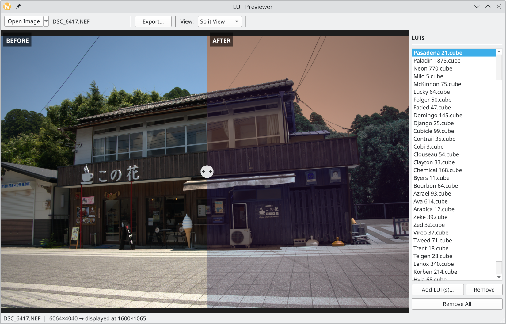

# LUT Previewer

A PyQt5 desktop app for previewing the effect of different LUT files (.cube) to your photos (RAW and non-RAW files supported).  
Load an image, add one or more LUTs, and compare results side by side using a draggable split view.  
Works in Linux and Windows.



## Features

- **Split before/after view** — drag the divider to compare original vs. LUT-applied
- **Multi-LUT sidebar** — load a whole folder of LUTs at once and click between them instantly
- **Background processing** — all LUTs are applied in parallel threads; the UI stays responsive
- **Full-resolution export** — saves at the original image resolution (not the display preview), as JPEG, PNG, or TIFF
- **Persistent history** — previously used LUTs are restored automatically on next launch
- **RAW support** — reads NEF, CR2, ARW, DNG and other camera RAW formats via rawpy

## Requirements

- Python 3.10+
- PyQt5 ≥ 5.15
- numpy ≥ 1.24
- Pillow ≥ 10.0
- rawpy ≥ 0.18 *(optional — required for full-resolution RAW files; JPEG/PNG work without it)*

## Setup
### Linux
```bash
git clone https://github.com/hestela/lut-previewer
cd lut-previewer
python3 -m venv venv
venv/bin/pip install -r requirements.txt
```

### Windows
First make sure you have Python3 installed and python3.exe can be ran from powershell.

```powershell
git clone https://github.com/hestela/lut-previewer
cd lut-previewer
python3.exe -m venv venv
.\venv\Scripts\pip.exe install -r .\requirements.txt
```
## Running
### Linux
```bash
venv/bin/python3 main.py
```
### Windows
```powershell
.\venv\Scripts\python.exe .\main.py
```
## Usage

1. Click **Open Image** and select a JPEG, PNG, TIFF, or RAW file
2. Click **Add LUT(s)…** in the sidebar and select one or more `.cube` files
3. Click a LUT name in the sidebar to see it applied in the split view
4. Drag the white divider handle to adjust the before/after split
5. Use the **View** menu to switch between Split / Before / After modes
6. Scroll to zoom, right-click drag to pan, double-click to reset zoom
7. Click **Export…** to save the current LUT applied at full resolution

LUTs added in previous sessions appear automatically in the sidebar on next launch.

## Supported formats

| Input images | JPEG, PNG, TIFF, BMP, NEF, CR2, CR3, ARW, DNG, ORF, RW2 |
|---|---|
| LUT files | Adobe `.cube` (3D LUT, any grid size) |
| Export | JPEG (quality 95), PNG, TIFF |
